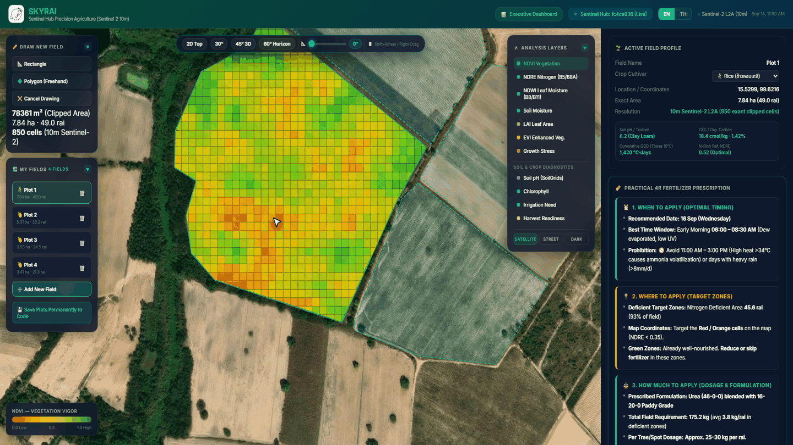
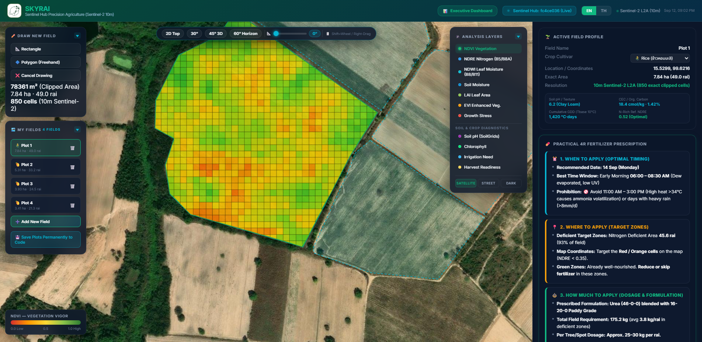
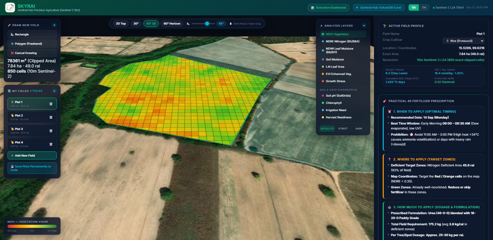
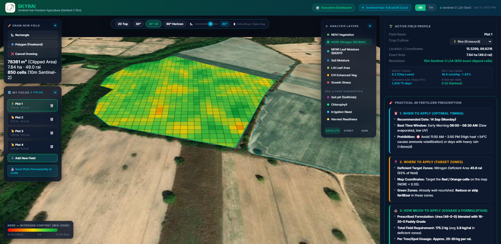
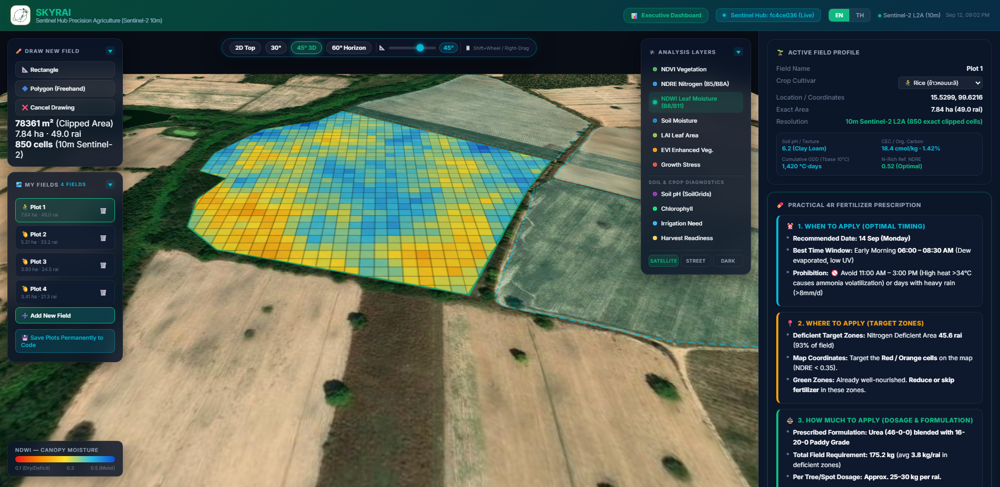
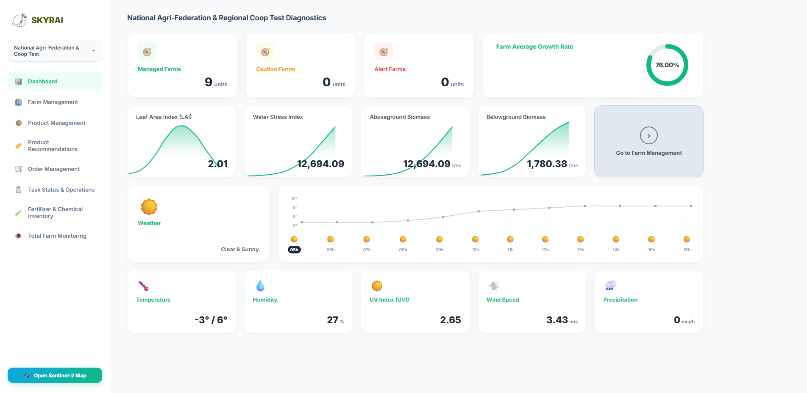

# SKYRAI

> Live Demo: [https://hi-shp.github.io/skyrai/skyrai.html](https://hi-shp.github.io/skyrai/skyrai.html)
> (Satellite data fetching requires running the local server. The static preview shows the UI layout.)

---



SKYRAI is a browser-based precision agriculture platform built on Sentinel-2 L2A satellite imagery at 10-meter resolution. It overlays multispectral vegetation indices on user-defined farm parcels, generates crop-specific fertilizer prescriptions using the USDA N-Rich Strip model, and integrates soil and weather data for application scheduling.

---

## GIS Map Interface



The main interface has three sections:

- Left panel: drawing tools (rectangle and freehand polygon) for defining farm boundaries, and a field list for managing multiple parcels
- Center: interactive Leaflet satellite map with color-coded spectral grid overlays clipped to field boundaries
- Right panel: field profile, 4R fertilizer prescription, spectral diagnostics, weather, and time-series charts

All registered fields remain visible as translucent boundary overlays while one field is selected for analysis.

---

## 3D Perspective View



The map supports CSS 3D perspective transforms. Tilt angle is adjustable from 0 degrees (top-down) to 60 degrees using preset buttons, a continuous slider, or mouse controls (Shift+Wheel / right-click drag).

---

## Spectral Analysis Layers

The system provides 11 spectral and soil diagnostic layers, each rendered as a 10m grid overlay:

<table>
  <tr>
    <td></td>
    <td></td>
  </tr>
  <tr>
    <td align="center">NDRE — Nitrogen content via Red-Edge (B5/B8A)</td>
    <td align="center">NDWI — Canopy moisture (B8/B11)</td>
  </tr>
</table>

Vegetation and Nitrogen:
- NDVI (Normalized Difference Vegetation Index)
- NDRE (Red-Edge Chlorophyll / Nitrogen)
- EVI (Enhanced Vegetation Index)
- LAI (Leaf Area Index)

Moisture and Water:
- NDWI (Leaf Canopy Water)
- Soil Moisture
- Irrigation Need

Soil and Crop Health:
- Soil pH via ISRIC SoilGrids 250m
- Chlorophyll
- Growth Stress
- Harvest Readiness

---

## Field Management

Users define farm parcels by drawing rectangles or freehand polygons directly on the map. Multiple fields can be registered simultaneously. Each field stores its boundary, area (hectares and rai), crop type, and analysis results in localStorage.

Supported crops: Rice, Durian, Cassava, Mango, Sugarcane, Oil Palm.


---

## 4R Fertilizer Prescription

The system generates a practical fertilizer prescription for the selected field, structured around the 4R framework:

1. When — Recommended application date and time window (e.g., early morning 06:00-08:30 after dew evaporation). Weather-based volatilization and leaching risk alerts.
2. Where — Deficit zone identification targeting cells where NDRE falls below 0.35, with 10m spatial precision. Healthy zones are flagged to reduce or skip application.
3. How Much — Crop-specific N-P-K dosages calculated in kg/rai and g/tree, based on the gap between measured NDRE and the N-Rich reference strip value.
4. How — Placement method (e.g., canopy drip-line banding), incorporation technique, and soil pH adjustment recommendations.

---

## Weather and Application Scheduling

The right panel includes a 7-day weather forecast (Open-Meteo), showing temperature, rainfall, wind speed, and humidity. A fertilizer loss and leaching risk bar is calculated from upcoming precipitation, and a 7-day spray suitability calendar marks safe application windows. Growing Degree Days (GDD, Tbase 10 C) are accumulated for growth stage estimation.

---

## Executive Dashboard



A separate management dashboard (`/dashboard`) provides:

- Farm-level KPIs: managed farm count, alert count, average growth rate
- Vegetation metrics: LAI, Water Stress Index, aboveground and belowground biomass
- Hourly weather timeline with condition icons
- Current conditions: temperature, humidity, UV index, wind speed, precipitation
- Navigation back to the Sentinel-2 GIS map

---

## Setup

Requirements:
- Python 3.8 or later
- A modern web browser (Chrome, Edge, Firefox, Safari)
- Sentinel Hub API credentials (free tier available at [sentinel-hub.com](https://www.sentinel-hub.com/))

Clone and run:

```
git clone https://github.com/hi-shp/skyrai.git
cd skyrai
```

Create a `.env` file with your Sentinel Hub credentials:

```
SENTINEL_HUB_CLIENT_ID=your_client_id
SENTINEL_HUB_CLIENT_SECRET=your_client_secret
PORT=8000
```

Start the server:

```
python server.py
```

Open `http://localhost:8000` in a browser.

---

## Data Sources

| Source | Resolution | Data |
|--------|-----------|------|
| Sentinel-2 L2A | 10m | B04 (Red), B05 (Red-Edge), B08 (NIR), B8A (Narrow NIR), B11 (SWIR) |
| ISRIC SoilGrids v2.0 | 250m | Soil pH, CEC, organic carbon, texture |
| Open-Meteo | point | 7-day temperature, precipitation, wind, humidity, GDD |

---

## Repository Structure

| File | Description |
|------|-------------|
| `skyrai.html` | Main single-file frontend application (Leaflet, Chart.js, dark glassmorphism UI) |
| `dashboard.html` | Executive management dashboard |
| `server.py` | Python HTTP server handling Sentinel Hub OAuth2 token lifecycle and static file serving |
| `.env` | API credentials and environment configuration |
| `auto_git_sync.py` | Background daemon that watches for file changes and auto-commits/pushes to GitHub |
| `assets/` | Screenshots and visual documentation |
